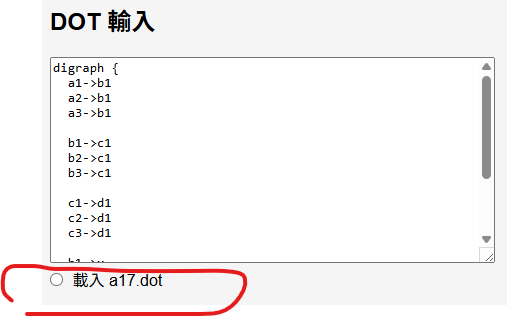
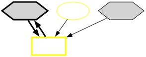

# A17 蘇菲的鍊金工房 ～不可思議書的鍊金術士～ DX 鍊金術查詢工具

## 鍊金術graph的說明
* 使用graph來表示鍊金術的行為
* 使用graphviz的DOT語言
* 搜尋節點、搜尋路徑的語言支援所有的DOT，只是針對遊戲，多了一層反查功能，方便找鍊金術的調和品
* 第一次使用時，直接載入a17.dot就好
* 會自動更新textarea內的graph
* 因為我目前只有玩a17，以後有機會再更新其他的鍊金內容
* 新增a23.dot，鍊金配方來自 [巴哈鍊金工房板這篇文章](https://forum.gamer.com.tw/Co.php?bsn=838&sn=29404)，不過我還沒玩過a23，如果發現有錯誤請通知我




### 節點(node)有三種：

+ 素材節點(橢圓形)：需要透過採集或購買的物品，無法以鍊金術合成出來
+ 調和品節點(長方形)：
    + 鍊金術的產物
        + 攻擊道具、回復道具、輔助道具、探索道具、裝飾品、鍊金釜
    + 武器製作的產物
    + 防具製作的產物
+ 類別節點(六角形)：
    所有素材和鍊金術的類別


### 路徑(path)有三種：

+ 素材或調和品與其類別的關係
    這個例子表示魔法草同時是植物類的類別和藥材的類別
    ```
    "魔法草" -> "植物類"
    "魔法草" -> "藥材"
    ```

+ 鍊金術材料與調和品的關係
    這個例子表示羅梅麥+紙+礦石可以調和出羅梅麥粉
    ```
    "羅梅麥" -> "羅梅麥粉"
    "紙" -> "羅梅麥粉"
    "礦石" -> "羅梅麥粉"
    ```

+ 武器、防具製作的材料與武器、防具的關係
    這個例子表示金屬塊+木材+礦石可以製作出旅行之杖
    ```
    "金屬塊" -> "旅行之杖"
    "木材" -> "旅行之杖"
    "礦石" -> "旅行之杖"
    ```
### 顏色

顏色代表不同屬性，白色屬性用雙線表示


## 查詢節點功能

輸入一個節點，已經有篩選功能，方便找尋

可往上或往下找X層相關節點

一般輸入2~3就夠，不要輸入太多層，會算很久

* 例如輸入海膽往下找兩層
    * 先看海膽的下1層節點
        * 路徑1,2是海膽的類別
        * 路徑3,4是海膽可以製作出的調和品有海膽袋和樸素烘焙點心

    然後可以**點選路徑**，可以看到相關的調和品有哪些

    

    * 再看海膽的下2層節點
        * 由於海膽的類別有食材，從路徑1,2,3,4可以看到食材相關的調和品，當然海膽也可以作為材料
        * 路徑5~20同上可看到植物類相關的調和品
        * 路徑21~24是海膽產出的調和品的類別或是可做為其他調和品的材料

```
海膽 的下1層節點是: 食材, 植物類, 海膽袋, 樸素烘焙點心
路徑1: 海膽->食材
路徑2: 海膽->植物類
路徑3: 海膽->海膽袋
路徑4: 海膽->樸素烘焙點心
海膽 的下2層節點是: 透明糖豆, 蘇磚蛋糕, 貝果三明治, 英雄降靈藥丸, 中和劑綠, 水果糖精, 天然酵母, 查科爾貼紙, 排毒油, 布料, 毛布, 亞達布料, 天鵝絨布, 萬能促進劑, 摘採手套, 同步的鍊金釜, 樸素烘焙點心, 蘇茶, 萬能除厄香, 大自然的服裝, 炸彈, 卡夫, 食品, 點心
路徑1: 海膽->食材->透明糖豆
路徑2: 海膽->食材->蘇磚蛋糕
路徑3: 海膽->食材->貝果三明治
路徑4: 海膽->食材->英雄降靈藥丸
路徑5: 海膽->植物類->中和劑綠
路徑6: 海膽->植物類->水果糖精
路徑7: 海膽->植物類->天然酵母
路徑8: 海膽->植物類->查科爾貼紙
路徑9: 海膽->植物類->排毒油
路徑10: 海膽->植物類->布料
路徑11: 海膽->植物類->毛布
路徑12: 海膽->植物類->亞達布料
路徑13: 海膽->植物類->天鵝絨布
路徑14: 海膽->植物類->萬能促進劑
路徑15: 海膽->植物類->摘採手套
路徑16: 海膽->植物類->同步的鍊金釜
路徑17: 海膽->植物類->樸素烘焙點心
路徑18: 海膽->植物類->蘇茶
路徑19: 海膽->植物類->萬能除厄香
路徑20: 海膽->植物類->大自然的服裝
路徑21: 海膽->海膽袋->炸彈
路徑22: 海膽->海膽袋->卡夫
路徑23: 海膽->樸素烘焙點心->食品
路徑24: 海膽->樸素烘焙點心->點心
```

* 若輸入一個類別node往上找1層，就會得到屬於該類別的素材或調和品
* 往上2層，可以再看該調和品的材料(素材節點往上找，必然找不到任何路徑)

```
水 的上1層節點是: 鈷藍草, 井水, 好喝的水, 基爾亨牛奶, 夜光水, 硝基水, 可疑液體, 噗尼的體液, 彩虹噗尼的體液, 龍之血晶, 聖水, 純水, 精靈之淚, 排毒油, 暮色水滴, 礦物精華
路徑1: 鈷藍草->水
路徑2: 井水->水
路徑3: 好喝的水->水
路徑4: 基爾亨牛奶->水
路徑5: 夜光水->水
路徑6: 硝基水->水
路徑7: 可疑液體->水
路徑8: 噗尼的體液->水
路徑9: 彩虹噗尼的體液->水
路徑10: 龍之血晶->水
路徑11: 聖水->水
路徑12: 純水->水
路徑13: 精靈之淚->水
路徑14: 排毒油->水
路徑15: 暮色水滴->水
路徑16: 礦物精華->水
水 的上2層節點是: 峰棉花, 顎松, 礦石, 銀靈結晶, 水晶碎片, 純水, 中和劑, 天然油, 植物類, 可疑液體, 妖精毒草, 水果糖精
路徑1: 峰棉花->純水->水
路徑2: 顎松->純水->水
路徑3: 礦石->純水->水
路徑4: 礦石->礦物精華->水
路徑5: 銀靈結晶->精靈之淚->水
路徑6: 水晶碎片->精靈之淚->水
路徑7: 純水->精靈之淚->水
路徑8: 中和劑->精靈之淚->水
路徑9: 中和劑->排毒油->水
路徑10: 中和劑->暮色水滴->水
路徑11: 中和劑->礦物精華->水
路徑12: 天然油->排毒油->水
路徑13: 植物類->排毒油->水
路徑14: 可疑液體->暮色水滴->水
路徑15: 妖精毒草->暮色水滴->水
路徑16: 水果糖精->礦物精華->水
```

## 查詢所有路徑功能
* 輸入想要的起點和終點node和hop數(path的跳躍次數)，可以找出可能路徑
    * 例如說要毛布的發想，要有帶熱的布料，此時發現手上有火岩石有帶熱屬性，就把起點node設定成火岩石；終點node設定成布料，先設定hop數6，會得到下面這些path，找尋能做的配方就可以調和出來
        * 例如說用了路徑13，火岩石->火藥->中和劑紅->燃料->綑起來的金線->線材->布料
        * 看起來有6 hop，但扣除類別關係，其實只要調和三次就可以完成


```
找到 火岩石 到 布料，最多 hop 數 6 的路徑共 16 條：

火岩石 到 布料 的 4 hop 路徑:
路徑1: 火岩石->火藥->深紅石->動物素材->布料

火岩石 到 布料 的 5 hop 路徑:
路徑1: 火岩石->炎帝粉->火藥->深紅石->動物素材->布料

火岩石 到 布料 的 6 hop 路徑:
路徑1: 火岩石->礦石->羅梅麥粉->火藥->深紅石->動物素材->布料
路徑2: 火岩石->礦石->結晶石塊->金屬->綑起來的金線->線材->布料
路徑3: 火岩石->礦石->心靈艾森礦->金屬->綑起來的金線->線材->布料
路徑4: 火岩石->礦石->金屬塊->金屬->綑起來的金線->線材->布料
路徑5: 火岩石->礦石->絲薇麗銀->金屬->綑起來的金線->線材->布料
路徑6: 火岩石->礦石->銣->金屬->綑起來的金線->線材->布料
路徑7: 火岩石->礦石->黃金艾森礦->金屬->綑起來的金線->線材->布料
路徑8: 火岩石->礦石->精靈銀塊->金屬->綑起來的金線->線材->布料
路徑9: 火岩石->礦石->日輪之滴->燃料->綑起來的金線->線材->布料
路徑10: 火岩石->礦石->日輪之滴->燃料->人偶師的線->線材->布料
路徑11: 火岩石->礦石->礦物精華->金屬->綑起來的金線->線材->布料
路徑12: 火岩石->礦石->精密零件->金屬->綑起來的金線->線材->布料
路徑13: 火岩石->火藥->中和劑紅->燃料->綑起來的金線->線材->布料
路徑14: 火岩石->火藥->中和劑紅->燃料->人偶師的線->線材->布料
```

例如調和出了有全能之力的鍊金黏土，想要做成小柯柯的武器隱藏式護手：極炎，這樣就很容易做出來了


```
找到 鍊金黏土 到 隱藏式護手：極炎，最多 hop 數 6 的路徑共 29 條：
鍊金黏土 到 隱藏式護手：極炎 的 4 hop 路徑:
路徑1: 鍊金黏土->黏土->先知水晶球->神秘之力->隱藏式護手：極炎
路徑2: 鍊金黏土->黏土->柯爾涅莉雅娃娃->神秘之力->隱藏式護手：極炎
路徑3: 鍊金黏土->萬靈藥->深紅石->精靈銀塊->隱藏式護手：極炎
路徑4: 鍊金黏土->萬靈藥->賢者之石->神秘之力->隱藏式護手：極炎
路徑5: 鍊金黏土->萬靈藥->生命之蜜->神秘之力->隱藏式護手：極炎
```

有些調和品，自己的類別也是自己的材料所需

例如先調和出了有全能之力特性的綑起來的金線，就可以先拿去做武器防具或裝飾品繼續遊戲

之後再依照需求，做出再附加第二項特性HPMP超強化的綑起來的金線來做更好的防具

金屬可用綑起來的金線


線材可用人偶師的線



黏土可用鍊金黏土


    
